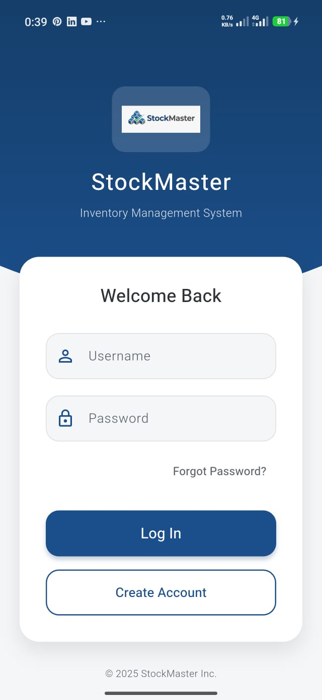
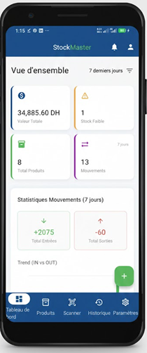
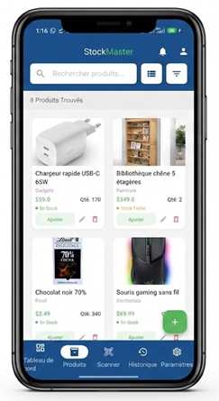
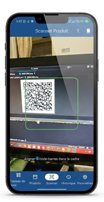
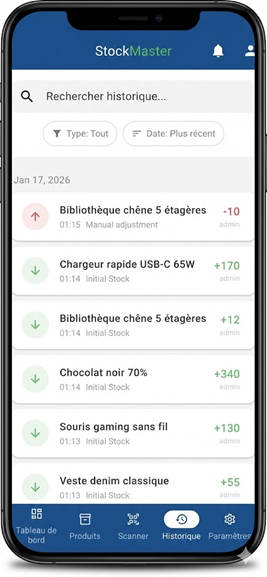
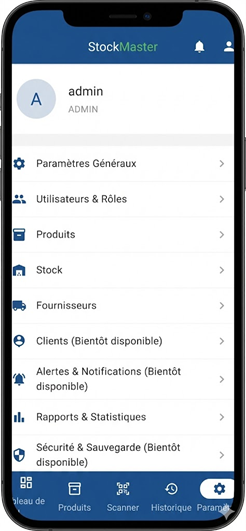

# StockMaster 📦

[](https://flutter.dev)
[](https://sqlite.org)
[](#)
[](#)
[](#)

**StockMaster** est une application ERP et de gestion de stock moderne, sécurisée et hors-ligne (Offline-first), développée avec **Flutter**. Elle s'adresse particulièrement aux petites structures (boutiques, garages, ateliers, commerces de proximité) désireuses de digitaliser et fiabiliser la gestion quotidienne de leurs inventaires.

---

## 📸 Galerie d'écrans (Aperçu)

Voici quelques aperçus de l'interface utilisateur de **StockMaster** :

| 🔐 Authentification | 📊 Tableau de Bord | 📦 Liste des Produits |
|:---:|:---:|:---:|
|  |  |  |

| 🔍 Scanner QR / Code-Barres | 🔄 Historique & Mouvements | ⚙️ Gestion des Droits (RBAC) |
|:---:|:---:|:---:|
|  |  |  |

---

## 🚀 Fonctionnalités Clés

### 1. 📊 Tableau de Bord Interactif
* **Suivi de la valorisation** globale du stock en temps réel.
* **Indicateurs clés de performance** (Total Produits, Alertes Stock Critique, etc.).
* **Visualisation graphique** des tendances de mouvements de stock (entrées/sorties).

### 2. 📦 Gestion du Catalogue (CRUD complet)
* Fiches produits riches : photo, SKU unique, prix d'achat/vente, quantité en stock, fournisseur.
* **Indicateurs de niveau visuels** : Vert (Stock Ok), Orange (Alerte basse), Rouge (Rupture).
* Moteur de recherche rapide et filtrage par catégorie ou état de stock.

### 3. 🔍 Scanner de Codes-barres & QR Codes
* Intégration de la caméra pour scanner les étiquettes en direct.
* Recherche instantanée ou création rapide de produits par code-barres.
* Outil de génération automatique de QR Codes de test fourni (`generate_qrs.py`).

### 4. 🔄 Traçabilité et Mouvements de Stock
* Enregistrement systématique de chaque entrée (réapprovisionnement) ou sortie (vente, perte, casse).
* Association de chaque mouvement à l'opérateur connecté et à un motif.
* Journal d'historique complet non-modifiable pour l'audit.

### 5. 📈 Rapports & Exports Professionnels
* Exportation de l'état du stock ou des mouvements au format **PDF** et **Excel / CSV**.
* Visualisation tabulaire filtrée par date, fournisseur ou statut.

### 6. 🔐 Sécurité & Gestion des Rôles (RBAC)
* Authentification sécurisée avec **hachage des mots de passe en SHA-256**.
* **Contrôle d'accès basé sur les rôles (RBAC)** configurable de façon dynamique :
    * 👑 **Administrateur** : Contrôle total (produits, rôles, permissions, statistiques et suppression).
    * 👤 **Employé** : Droits restreints (lecture seule, saisie de mouvements simples).

### 🌓 Mode Sombre / Clair & Traduction
* Interface adaptative supportant le **Dark Mode** natif (Material 3).
* Support multilingue fluide (Français & Anglais) via un gestionnaire d'état de langue.

---

## 🛠️ Stack Technique & Architecture

### Architecture logicielle
Le projet respecte scrupuleusement le design pattern **MVVM (Model-View-ViewModel)** :
* **Model** (`lib/models/`) : Définition des structures de données (`Product`, `User`, `StockMovement`).
* **View** (`lib/views/`) : Composants d'interface (UI Widgets) découplés de la logique métier.
* **ViewModel** (`lib/viewmodels/`) : Gestion de l'état et logique de présentation réactive via le package `Provider`.
* **Services** (`lib/services/`) : Persistance locale via un singleton `DatabaseHelper` pilotant SQLite.

```mermaid
graph TD
    User[Utilisateur] --> View[View (UI Widgets)]
    View -->|Action/Événement| VM[ViewModel (Provider)]
    VM -->|Notification de mise à jour| View
    VM -->|Opérations CRUD| Service[Services (DatabaseHelper)]
    Service -->|Requêtes SQL| DB[(SQLite Database)]
    DB -->|Résultat brut| Service
    Service -->|Modèles Typés| VM
```

### Technologies clés
* **Framework :** Flutter (Dart)
* **Base de données :** SQLite (`sqflite` pour l'approche offline-first)
* **Gestion d'état :** Provider
* **Chiffrement :** Crypto (Hachage SHA-256)
* **Graphiques :** FL Chart
* **Scanning :** Mobile Scanner

---

## 📚 Structure de la Documentation

Le projet propose une documentation extrêmement complète :

1. 📂 **Documentation Technique (`docs/`)** :
    * 🏛️ [**Architecture**](docs/ARCHITECTURE.md) : Détail du flux MVVM, Providers et sécurité.
    * 💾 [**Schéma Base de Données & API**](docs/DATABASE_API.md) : Tables SQLite (`users`, `products`, `movements`) et requêtes clés.
    * 🚀 [**Installation & Guide d'Utilisation**](docs/INSTALLATION_USAGE.md) : Prérequis système et guide d'utilisation pas à pas.
    * 🧩 [**Widgets UI**](docs/WIDGET_STRUCTURE.md) : Liste des composants d'interface par écran.
    * 🤝 [**Guide de Contribution**](docs/CONTRIBUTING.md) : Bonnes pratiques et standards de code pour les développeurs.
2. 💻 **Supports Interactifs compilés** :
    * 🏠 [**Projet Landing Page**](stockmaster_landing/index.html) : Site de présentation marketing de l'application.
    * 🗺️ [**Interactive Modules Map**](stockmaster_map/modules_map.html) : Visualisation interactive des dépendances et modules du projet.
    * 🎭 [**Scénario de Démonstration**](stockmaster_scenario/scenario_demo.html) : Scénario utilisateur guidé pas à pas.
    * 📈 [**Rapport Interactif de Widgets**](docs/index.html) : Tableau de bord web listant les statistiques des widgets.
3. 📝 [**Rapport Universitaire (LaTeX)**](Rapport-StockMaster.tex) / [**Rapport PDF**](fluttCahier.pdf) : Cahier des charges et rapports académiques complets.

---

## 🚀 Installation et Lancement

### 1. Prérequis
Assurez-vous d'avoir installé le **SDK Flutter** (version stable récente) ainsi que votre environnement de développement cible (Android SDK / iOS / Windows C++ tools).

### 2. Cloner le projet
```bash
git clone https://github.com/Anas15161/stockmaster.git
cd stockmaster
```

### 3. Récupérer les dépendances
```bash
flutter pub get
```

### 4. Lancer l'application
Démarrez votre émulateur ou branchez votre appareil physique, puis lancez :
```bash
flutter run
```
*Note : La base de données SQLite `stockmaster.db` est initialisée automatiquement lors du premier lancement de l'application.*

### 5. Comptes de test par défaut
Pour faciliter l'évaluation, des comptes de démonstration pré-configurés sont disponibles :

| Rôle | Nom d'utilisateur (Username) | Mot de passe | Permissions |
|:---|:---|:---|:---|
| 👑 **Administrateur** | `admin` | `admin123` | Accès total (Modifs, Rapports, RBAC) |
| 👤 **Employé** | `employee` | `employee123` | Consultation, Scan et Mouvements uniquement |

---

## 👥 Contexte Académique & Auteurs

Ce projet a été réalisé dans le cadre du module de **Développement Mobile** en **2ème année Génie Informatique (2GInf) - EMG** pour l'année universitaire **2025/2026**.

* **Étudiants :**
  * **Anas HADDOU**
  * **Alae Eddine MEHDI**
* **Encadrant :**
  * **M. Samir BARA** (PhD, MCH)

---
*© 2026 StockMaster Inc. - Projet Universitaire*
